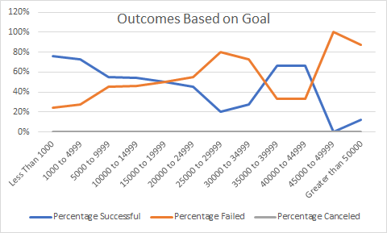

# Kickstarter Analysis with Excel

## Overview of Project

### Purpose
The purpose of this project is to analyze data taken from Kickstarter,
a popular fundraising platform, to assess how different fundraising campaigns
fare in relation to their launch dates and their funding goals. This analysis
was performed on behalf of my cliente, Louise, to determine how the fundraising
campaign for my cliente's play "Fever" compares to the general trend in theater
Kickstarter campaigns.

## Analysis and Challenges

### Analysis of Outcomes Based on Launch Date
Using the Kickstarter dataset, I created a pivot table to visualize the number of
successful, failed, and canceled campaign outcomes based on the launch month.
The following image is a line chart based on the results of the pivot table created.

### Analysis of Outcomes Based on Goals
I also created the line graph referenced below to visualize the percentage of
successful, failed, and canceled plays based on the funding goal amount.

### Challenges and Difficulties Encountered
One possible challenge that could be encountered with creating the chart and graph
pertaining to the outcomes based on launch date came when trying to filter down to
the month, given there was no option for month and this had to be derived from Date
Created Conversion.

## Results
- Two conclusions made from the Outcomes based on Launch Date graph is that, one, May
has been the most successful month for launching campaigns, and two, the number of failed
campaigns remained relatively consistent month over month from January to August.

- From the Outcomes Based on Goals graph, it can be concluded there were no canceled
plays.

- One limitation of this dataset is that there were only roughly 1,000 plays to reference.
The data also was limited in the relatively short time Kickstarter has been around.

- Other possible tables and graphs I could create would be charts showing outcomes based
on the launch year to see how campaign outcomes on Kickstarter has trended over time.
It would also be interesting to see how the construct of the campaign blurb, specifically,
how percentages of abstract nouns used and concrete nouns used, correlates with the
campaign outcomes.
